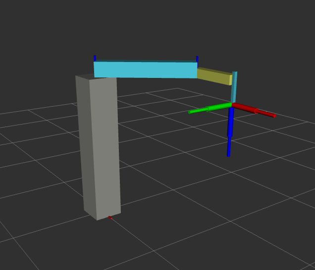
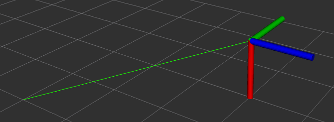

# Dokumentacja projektu - laboratorium 4

### 1. Wprowadzenie

Celem projektu było stworzenie własnego pakietu **ros2**, którego gównym celem byla interpolacja liniowa. Pakiet ten miał za zadanie wyznaczać ruch robota, na podstawie danych przez użytkownika. Dodatkowo neleżał zaimplementować inną interpolację, w naszym przypadku skorzystaliśmy z interpolacji wielomianem 3 stopnia. 

### 2. Implementacja
Stworzono dwa węzeły _joint.py_ i _oint.py_, pierwszy z nich odpowiadał za interpolację stawów robota, drugi natomiast odpowiada za interpolację punktu w przestrzeni 3D. Wewnątrz programu są obliczane wszystkie potrzebne parametry.

### 3. Sposób działania

Węzeł _joint.py_ działa w prosty sposób. Po podaniu mu pozycji końcowych odpowiednich stawów węzeł interpoluje zadaną trasę stawów w podany sposób (liniowy lub wielomianem 3 stopnia)

Węzeł _oint.py_ działa w bardzo podobny sposób, jednak zajmuje się on interpolacją punktu w przestrzeni 3D. Zajmuję się on zmianą pozycji oraz rotacji jednocześnie.

### 4. Sposób uruchamienia

Zostały stworzone trzy pliki _launch_:
* jnit.launch.py - odpala węzeł interpolujący ruch robota
* oint.launch.py - odpala węzeł interpolujący ruch punktuL
* rviz.launch.py - odpala program wizualizacyjny

W pierwszej kolejności budujemy nasz pakiet przy użyciu komendy:

`colcon build`

Kolejno należy użyć komendy określajcej źródło:

`source install/setup.bash`

Gdy nasz pakiet jest poprawnie zbudowany możemy przejść do uruchmienie kolejnych węzłów naszej symulacji. Przy pomocy komendy _ros2 launch zadanie4 **nazwa pliku launch**_ możemy uruchomić potrzebne nam węzły i programy. Najlepiej odpalić pliki launch pojedyńczo w różnych terminalach, dzieki temu będziemy mieli pełen wgląd na sytuację. Jednocześnie uruchomimy program RVIZ.

Przy pomocy komendy:

_ros2 service call /interpolation_params zadanie4_srv/srv/JintControlSrv "{newpoz1: 1.0, newpoz2: 1.0, newpoz3: -0.2, time: 5.0, interpolation: linear}"_

Aby zinterpolować ruch punktu należy wprowadzić komendę:

_ros2 service call /interpolation_params_oint zadanie4_oint_srv/srv/OintControlSrv "{newx: 0.0, newy: 0.0, newz: 0.0, newroll: 0.0, newpitch: 0.0, newyaw: 0.0, time: 5.0, interpolation: spline}"_

Obrazek demostrujący ruch robota

Obrazek demonstrujący ruch punktu:

###Członkowie zespołu:

Hubert Kozubek, Przemysław Michalczewski
