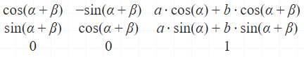
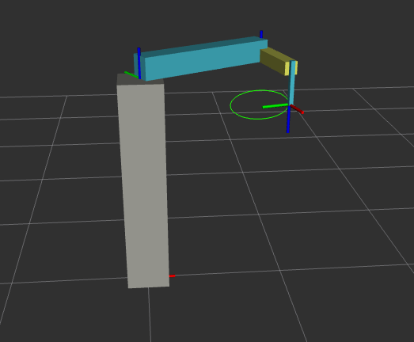

# Dokumentacja projektu - laboratorium 5

### 1. Wprowadzenie

Celem projektu było stworzenie własnego pakietu **ros2**, którego gównym celem bylo rozwiązanie zadania kinematyki odwrotnej. Pakiet ten miał za zadanie wyznaczać pozycje przegubów na podstawie pozycji końcówki, oraz rysować prostokąt i elipsę. 

### 2. Implementacja
Stworzono dwa węzeły _ikin.py_ i _oint.py_, pierwszy z nich odpowiadał za rozwiązanie zadania kinematyki odwrotnej, drugi natomiast odpowiada za zadawanie kolejnych punktów robotowi. Wewnątrz programu są obliczane wszystkie potrzebne parametry.

### 3. Sposób działania

Węzeł _ikin.py_ działa w prosty sposób. Po podaniu mu pozycji koncówki robota za pomocą wzorów matematycznych oblicza on kąty obrotu oodpowiednich stawów oraz wysunięcia stawu pionowego.

Węzeł _oint.py_ natomiast zadaje kolejne punkty i publikuje je na węzeł ikin.

### 4. Wyliczanie kinematyki odwrotnej

Robot został zaprojektowany w taki sposób, że pierwsze oraz drugie ramie odpowiadają wyłącznie za pozycję **x**, **y** końcówki, natomiast 3 ramie odpowiada wyłącznie za pozycję **z** końcówki. Dzięki temu możemuy rozbić problem na 2 mniejsze problemy.

#### Pozycja x,y
korzystając z macierzy transformacji odpowiednich ramion oraz wykorzystując zmienną pomocniczą β jako kąt ramienia 2 od osi x ( a nie od ramienia 1) mamy
*Ramie1:

*Ramie2:

Po wymnożenieu otrzymujemy:

Ponieważ nie interesuje nas obrót końcówki robota wystarczy porównać tylko wektor translacji z znanym wektorem współrzędnych

[T4](T4.png)

### 5. Sposób uruchamienia

Zostały stworzone trzy pliki _launch_:
* ikin.launch.py - odpala węzeł rozwiązujący kinematykę odwrotną
* oint.launch.py - odpala węzeł zadający kolejne położenia
* rviz.launch.py - odpala program wizualizacyjny

W pierwszej kolejności budujemy nasz pakiet przy użyciu komendy:

`colcon build`

Kolejno należy użyć komendy określajcej źródło:

`source install/setup.bash`

Gdy nasz pakiet jest poprawnie zbudowany możemy przejść do uruchmienie kolejnych węzłów naszej symulacji. Przy pomocy komendy _ros2 launch zadanie5 **nazwa pliku launch**_ możemy uruchomić potrzebne nam węzły i programy. Najlepiej odpalić pliki launch pojedyńczo w różnych terminalach, dzieki temu będziemy mieli pełen wgląd na sytuację. Jednocześnie uruchomimy program RVIZ.

Przy pomocy komendy:

_ros2 service call /interpolation_params_oint zadanie5_ikin_srv/srv/IkinControlSrv "{figure: elipsa}"_

możemy rozpocząć rysowanie figur

parametr figure może przyjmować wartości 
* elipsa - rysuje elipse
* prostokat - rysuje prostokąt
* punkt - zmienia punkt początkowy rysowania  z (1,0) na (0,1) 

Obrazek demostrujący robota rysującego elipsę

Obrazek demonstrujący robota rysującego prostokąt:

###Członkowie zespołu:

Hubert Kozubek, Przemysław Michalczewski
