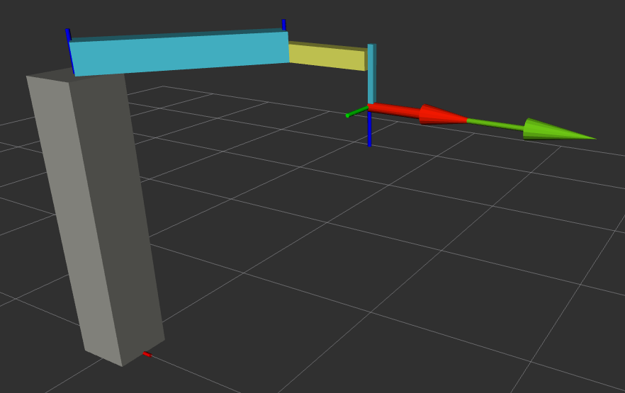
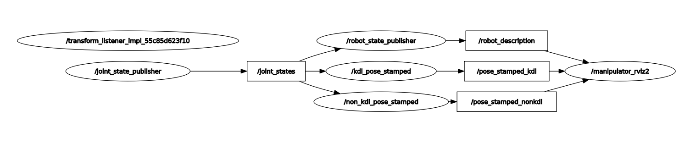

# Dokumentacja projektu - laboratorium 3

### 1. Wprowadzenie

Celem projektu było stworzenie własnego pakietu **ros2**, ktrego gównym celem byla obsluga kinematyki prostej. Pakiet ten miał za zadanie wyliczać pozycje końcówki robota, tak aby zadzała się z jego realnym połorzeniem.

### 2. Implementacja
Stworzono dwa węzły _non_kdl_dkin.py_ i _kdl_dkin.py_, odpowiaday one za wyliczenia pozycji końcówki "ramienia" robota. Jak nazwa wskazuje węzeł _non_kdl_ nie korzystał z dostępnego w pythonie pakiety PyKDL. Natomiast program _kdl_ używał wcześniej wspomnianego pakietu.

Zostaly rowniez wprowadzone zmiany w pliku join_state_publisher.py. Węzeł **joint_state_publisher** odpowiadał za obsługę stawów robota, przy pomocy parametrów mogliśmy w czasie rzeczywistym zmieniać pozycje poszcczególnych elementów robota. Węzeł ten był odpowiedzialny również za sprawdzani, czy parametry które próbujemy zadać nie są błędne.

### 3. Sposób działania

Węzeł _non_kdl_dkin.py_ rozwiązuje problem położenia końcówki w sposób analityczny. Wyznacza on macierze wszystkich stawó robota, a następnie przemnaża je. Z ostatecznej macierzy możemy wyczyctać potrzebne nam informacje, które przekształcając w odpowiedni sposób dają nam połorzenie końcówki.

Węzeł _kdl_dkin.py_ działa w bardzo podobny sposób, jednak dzięki modułowi PyKDL wykonuje on wszystko automatycznie.

### 4. Sposób uruchamienia

Zostały stworzone cztery pliki _launch_:
* non_kdl_dkin.launch.py - odpala węzeł nie używający modułu PyKDL
* kdl_dkin.launch.py - odpala węzeł używający modułu PyKDL
* rviz.launch.py - odpala program wizualizacyjny

W pierwszej kolejności budujemy nasz pakiet przy użyciu komendy:

`colcon build --symlink-install --packages-select zadanie3`

Kolejno należy użyć komendy określajcej źródło:

`source install/setup.bash`

Gdy nasz pakiet jest poprawnie zbudowany możemy przejść do uruchmienie kolejnych węzłów naszej symulacji. Przy pomocy komendy _ros2 launch zadanie3 **nazwa pliku launch**_ możemy uruchomić potrzebne nam węzły i programy. Najlepiej odpalić wszystkie pliki launch w 3 różnych terminalach, dzieki temu będziemy mieli pełen wgląd na sytuację. Jednocześnie uruchomimy program RVIZ.

Zmieniając wartości parametrów przy pomocy komendy:

_ros2 param set /join_state_publisher poz* "wartość"_

**poz1, poz2, poz3** - położenia odpowiednich stawów robota.

Poglądowy zdjęcie robota:

Obrazek demonstrujący połączenia węzłów:

###Członkowie zespołu:

Hubert Kozubek, Przemysław Michalczewski
